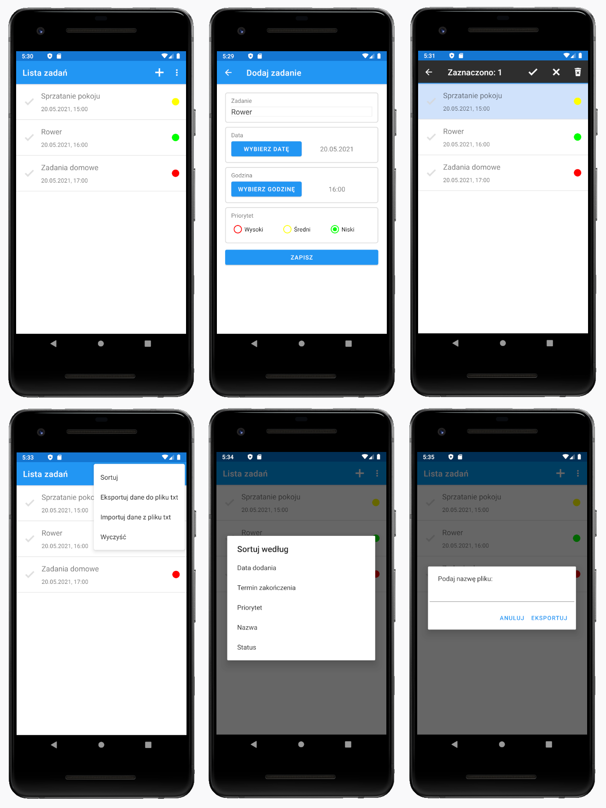

# ToDoList
ToDoList is an app where you can plan and manage your tasks. It enables you to store data about task you did or you're gonna do, time, date and priority.

## Table of contents
* [Technology](#technology)
* [Installation](#installation)
* [Features](#features)
* [Screenshots](#screenshots)

## Technology
Project is created with:
* Android Studio 4.1.2

## Installation

1. Clone the repository to "AdroidStudioProjects" folder

## Features
List of features:
* Showing list of tasks
* Adding, editing and deleting records from list of tasks
* Deleting all rows in list
* Sorting the tasks
* Exporting and importing text files

## Screenshots

    

